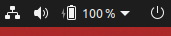

# Poweroff Button on Topbar
## Add Poweroff Button on Topbar in GNOME Shell Extension

License 
==============
[GPL-3.0](../LICENSE.txt)

Requirements
==============

- GNOME Shell 3.36+

Changelog
==============
- v3 (18-10-2021)
  - Review constructors
- v2 (15-10-2021)
  - Fix issue with 3.38
- v1 (04-04-2020)
  - First Commit with base functionality
